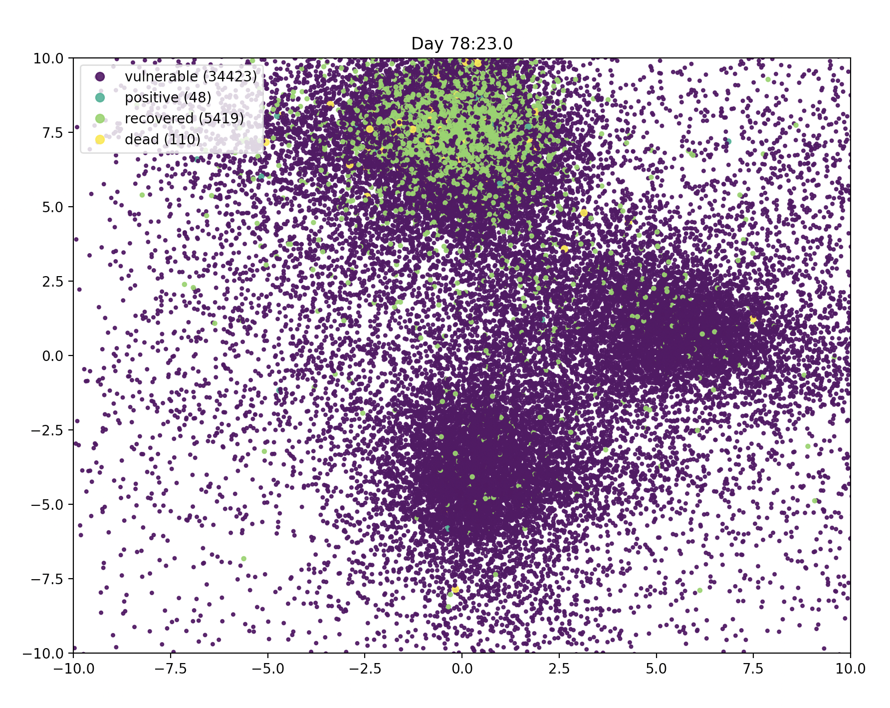

# Pandemic

An agent model in which commuting, compliance, testing and contagion parameters drive
infection in a population. Agents follow OU drift processes
on the plane. Viral load is estimated from geohashing. A population 
of 100,000 or so can be used without issue. Contributions are welcome. 

The author is not an epidemiologist. There is nothing sacrosanct about the default parameters. Opinions and issues
are most welcome. 

### Usage 

    pip install pandemic
    >> from pandemic import run
    >> run()

### Basic elements of the model 

Covered in this post 
